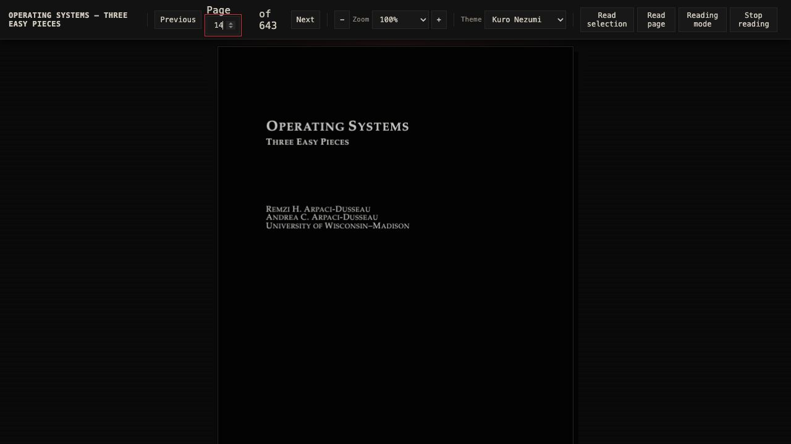

# local-tts

An Apple-Silicon-first, fully local PDF-to-speech study tool. v1 uses
Kokoro-82M with MLX, keeps inference behind a backend interface, and writes
chunk-level checkpoints so interrupted chapter renders resume safely.

## Requirements

- macOS on Apple Silicon
- [uv](https://docs.astral.sh/uv/)
- ffmpeg (`brew install ffmpeg`)
- Python 3.11 or 3.12 (the project intentionally excludes Python 3.13+ until
  the MLX Kokoro dependency supports them)

The first inference downloads the Apache-2.0 Kokoro MLX weights into the local
Hugging Face cache. No API key is needed. Later runs resolve that cache locally
before loading Kokoro, avoiding a model-network or metadata check.

## Setup

```bash
cd ~/projects/local_tts
brew install uv                 # only if uv is not already installed
uv python install 3.12
uv sync --extra dev
uv run pytest
```

To use local LLM study conclusions, install the optional MLX-LM dependency:

```bash
uv sync --extra summarize
```

## What is included

- PDF outline/metadata inspection; one chapter, chapter ranges, page ranges,
  or the whole book as independent, resumable outputs.
- Conservative technical-PDF cleanup, including layout-aware code, schema, and
  table detection; headers, footnotes, URLs, citations, and technical blocks
  each have an explicit reading policy.
- Kokoro MLX narration with m4a, m4b, or mp3 encoding; explicit pronunciation
  repairs; chapter audio tags; and chunk-level crash recovery.
- Local concluded summaries and two-voice American-English study podcasts.
- Local English-to-Persian translation and Farsi narration, with exact source
  protection for technical terms and names.
- A loopback streaming API plus local PDF.js reader with selection/page/reading
  controls, synchronized spoken-text highlighting, high-detail zoom, and Kuro
  Nezumi, default, or custom reader themes.
- Resource profiles, live terminal progress/rates, and a repeatable benchmark.

## Quick start

```bash
cd ~/projects/local_tts
uv sync --extra dev
uv run local-tts ~/Books/book.pdf --list
uv run local-tts ~/Books/book.pdf --config config/study-reader.toml --chapter 3
```

The command prints progress to stderr. Extraction and analysis show items per
second; speech and benchmark work show generated-audio seconds per wall-clock
second (`x realtime`). Its final JSON result remains on stdout, so it is safe
to pipe into another local command.

## Command cookbook

### Inspect and select PDF content

```bash
# Extract the outline and human-facing page ranges.
uv run local-tts ~/Books/book.pdf --list

# Inspect embedded title, author, producer, attachments, and table-of-contents metadata.
uv run local-tts ~/Books/book.pdf --metadata

# Render exactly one outline chapter, a chapter range, arbitrary pages, or all chapters.
uv run local-tts ~/Books/book.pdf --chapter 3
uv run local-tts ~/Books/book.pdf --chapters 3-5 --profile max
uv run local-tts ~/Books/book.pdf --pages 120-160 --format m4b
uv run local-tts ~/Books/book.pdf --profile balanced

# Resume only durable chunks after an interruption.
uv run local-tts ~/Books/book.pdf --pages 120-160 --resume
```

Chapter ranges and whole-book runs write independent files such as
`output/chapter-03.m4b`; a later failed chapter never invalidates an earlier
one. The durable PCM stream and checkpoint journal are stored beneath the
matching hidden directory, for example `output/.chapter-03.local-tts/`.

### Choose the narration and technical-reading policy

```bash
# Calm technical-reader preset: voice, pace, joins, pronunciation repairs,
# layout-aware technical-block explanations, and m4b output.
uv run local-tts ~/Books/book.pdf \
  --config config/natural-explanatory-reader.toml --chapter 3

# Override just the policy needed for this run.
uv run local-tts ~/Books/book.pdf --pages 120-160 \
  --voice af_bella --speed 0.94 --chunk-pause-ms 180 --format mp3 \
  --code explain --schemas explain --tables explain \
  --urls skip --citations skip --footnotes skip
```

The supplied configs are starting points:

- [study-reader.toml](config/study-reader.toml) — smooth English technical reading.
- [natural-explanatory-reader.toml](config/natural-explanatory-reader.toml) —
  slower technical reading, local conclusions, and the two-voice podcast pair.
- [farsi-study-reader.toml](config/farsi-study-reader.toml) — local Persian
  translation/narration plus protected source terminology.

### Create a local conclusion or a two-voice podcast

```bash
uv sync --extra summarize

# Selected pages are primary evidence; bounded current/previous/reference
# chapter context is recorded in a sidecar before conclusion narration.
uv run local-tts ~/Books/book.pdf \
  --config config/natural-explanatory-reader.toml --pages 120-160 --summarize

# Create a source-bound, alternating host/explainer study discussion.
uv run local-tts ~/Books/book.pdf \
  --config config/natural-explanatory-reader.toml --chapter 3 --podcast
```

`--summerize` remains accepted as a compatibility alias for `--summarize`.
Summaries write Markdown, provenance/cost details, and optional audio. Podcasts
also retain their alternating-voice transcript and per-turn resume state.

### Translate to Persian without translating names or technical terms

```bash
uv sync --extra farsi
uv run local-tts setup-farsi --voice fa_IR-ganji_adabi-medium

uv run local-tts ~/Books/book.pdf \
  --config config/farsi-study-reader.toml --pages 120-160
```

The preset uses local NLLB translation followed by the selected local Piper
Farsi voice. It writes a reviewable `*.translation.json` sidecar and can resume
translation and audio independently. Keep exact source terms in the config:

```toml
[translation.protect]
"PostgreSQL" = true
"B-tree" = true
"Hennessy" = true
```

Protected entries win over `[translation.glossary]` and transliteration rules.
The preset also supplies a gentler Farsi rate and explicit Piper stability
controls; tune them with `--farsi-noise-scale` and `--farsi-noise-w-scale`.

### Benchmark and control host pressure

```bash
# Run before a long book on an otherwise idle Mac.
uv run local-tts benchmark --profile balanced --runs 3

# Use the most aggressive profile, or tune an individual bounded resource.
uv run local-tts ~/Books/book.pdf --chapter 3 --profile max
uv run local-tts ~/Books/book.pdf --chapter 3 \
  --cpu-threads 4 --prefetch 4 --chunk-chars 900 --memory-gb 12
```

The benchmark probes practical chunk sizes, reports process/accelerator memory
telemetry, and recommends the highest measured real-time factor within the
selected advisory MLX memory ceiling.

## Local PDF.js reader and streaming API

```bash
cd ~/projects/local_tts
uv sync --extra server
uv run local-tts setup-viewer               # one-time local PDF.js install
uv run local-tts read ~/Books/book.pdf \
  --config config/natural-explanatory-reader.toml --port 8765
```

The reader opens on loopback only. Select text, use **Read selection**, **Read
page**, or **Reading mode**, and stop at any time. It displays PDF-load and
speech-preparation progress, highlights the spoken source text, and supports
50–600% zoom with high-detail canvas rendering. Use `--theme default` for the
standard PDF.js theme, or `--theme custom --theme-css ~/path/reader.css` for a
local stylesheet.



The screenshot is a local PDF.js reader session using the Kuro Nezumi theme;
the document content never leaves the loopback server.

To integrate another local PDF.js view or a script, start the loopback API:

```bash
uv run local-tts serve --config config/natural-explanatory-reader.toml --port 8765

curl --no-buffer http://127.0.0.1:8765/v1/speech/stream \
  -H 'content-type: application/json' \
  -d '{"text":"Read this locally with the configured voice.","voice":"af_bella"}'
```

`/v1/speech/stream` returns progressive NDJSON PCM records with exact source
offsets for highlighting; `/v1/speech/wav` returns a progressive WAV stream.
Both endpoints remain local and serialize inference so competing requests do
not reduce Apple-GPU throughput.

## Resource profiles

| Profile | CPU threads | Batch size | Prefetch | Chunk chars | MLX memory ceiling |
| --- | ---: | ---: | ---: | ---: | ---: |
| `max` | 8 | 1 | 8 | 1400 | 18 GB |
| `balanced` | 4 | 1 | 4 | 900 | 12 GB |
| `low` | 2 | 1 | 2 | 500 | 6 GB |
| `custom` | explicit flag | explicit flag | explicit flag | explicit flag | explicit flag |

The MLX backend applies the memory value through `mlx.set_memory_limit` before
model load. MLX documents this as an allocation guideline, rather than a hard
limit on the whole macOS process. `--cpu-threads`,
`--batch-size`, `--prefetch`, `--chunk-chars`, and `--memory-gb` override
profile values. The selected Kokoro MLX package exposes a serial inference
instance, so batch size is currently fixed at 1 in practice and retained as a
backend-neutral setting for later adapters.

Run the benchmark on an otherwise idle machine before a long book. It sweeps
500, 900, and 1400-character chunks using a multi-chunk technical passage and
recommends the fastest measurement inside the selected profile's MLX ceiling:

```bash
uv run local-tts benchmark --profile balanced --runs 3
```

## v1 implementation status

- [x] PDF page and extracted-outline inspection; page/chapter/range/whole-book selection
- [x] conservative technical-text cleanup and bounded text chunking
- [x] MLX Kokoro backend; ffmpeg output to m4a, m4b, or mp3
- [x] append-only PCM checkpoints and verified `--resume`
- [x] benchmark sweep with generated-audio-seconds / wall-clock-second, peak RSS, and MLX telemetry
- [x] layout-aware code, schema, and table detection; embedded PDF metadata in sidecars and audio tags
- [ ] compare MLX with official Kokoro PyTorch/MPS and a practical CoreML port

## Notes on output and reliability

The model has one serial inference path. v1 keeps it fed by using bounded text
chunks and a bounded cleanup-worker queue while inference runs, and avoids
large accumulated waveform buffers. Final encoding happens from a single
on-disk PCM stream, so an encoding failure does not lose completed synthesis.
The entire command keeps one ordered `pypdf` reader open, avoiding a full PDF
reparse for every independently rendered chapter.

See [technical reading and narration policy](docs/reading-policy.md) for
`skip`/`explain`/`read` handling of code, schemas, and tables plus the supplied
smooth-reader configuration. See [PDF layout and metadata](docs/pdf-layout.md)
for the detection and tagging behaviour.
See [local concluded summaries](docs/summaries.md) for the optional 4-bit MLX
summary model, context limits, and output artifacts. See [local two-voice
podcasts](docs/podcasts.md) for the American-English host/explainer study mode.
See [local Persian translation and narration](docs/persian.md) for the
Qwen-to-Piper Farsi path, voice setup, glossary, and reviewable translation
artifacts.
See [the local streaming server and PDF.js bridge](docs/server-pdfjs.md) to
read selections or current PDF.js pages with synchronized highlights.
